# Production-Ready Monitoring Stack using Prometheus & Grafana

## Overview

This project demonstrates deploying a production-ready Kubernetes monitoring stack using the **kube-prometheus-stack** Helm chart on a **Minikube multi-node cluster**.

The deployed monitoring stack includes:

- Prometheus
- Grafana
- Alertmanager
- Prometheus Operator
- kube-state-metrics
- Node Exporter

---

# Technologies

- Kubernetes
- Minikube
- Helm
- Prometheus
- Grafana

---

# Project Tasks

### ✅ Configure Helm

- Added Prometheus Community Helm repository.
- Updated Helm repositories.
- Verified the latest kube-prometheus-stack chart.

### ✅ Deploy Monitoring Stack

- Created the `monitoring` namespace.
- Installed the kube-prometheus-stack using Helm.
- Waited until all resources became ready.

### ✅ Verify Installation

Verified the following Kubernetes resources:

- Pods
- Services
- Deployments
- StatefulSets
- DaemonSets
- ConfigMaps
- Secrets
- ServiceAccounts

### ✅ Verify Monitoring Components

Successfully verified:

- Prometheus Server
- Grafana
- Alertmanager
- Prometheus Operator
- kube-state-metrics
- Node Exporter

### ✅ Grafana Verification

Verified:

- Successful login
- Prometheus configured as the default data source
- Alertmanager configured
- Kubernetes dashboards displaying metrics

### ✅ Prometheus Verification

Verified:

- Target Health
- Service Discovery
- PromQL query execution (`up`)
- Kubernetes monitoring targets

### ✅ Deploy Sample Application

Deployed an NGINX sample application and verified:

- Pod is running
- Service is available

---

# Screenshots

## Helm Release

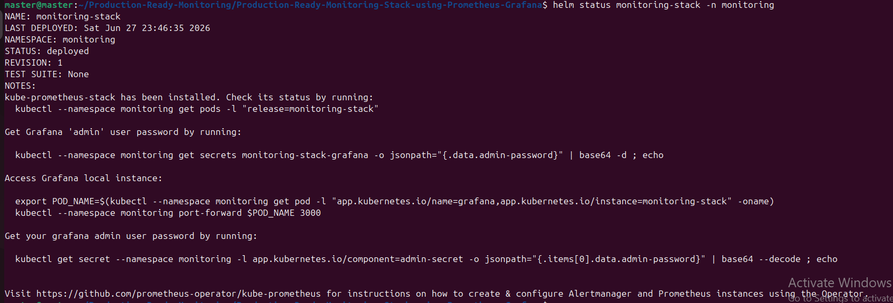

---

## Monitoring Pods

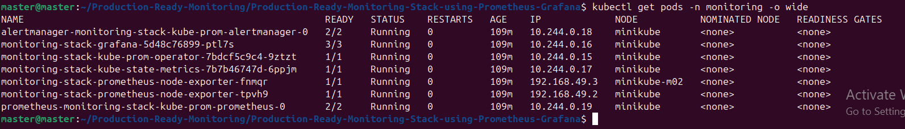

---

## Monitoring Services

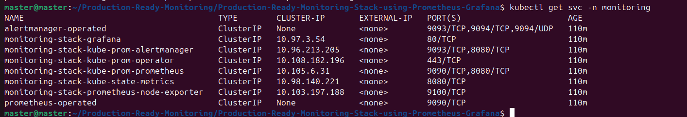

---

## Service Monitors

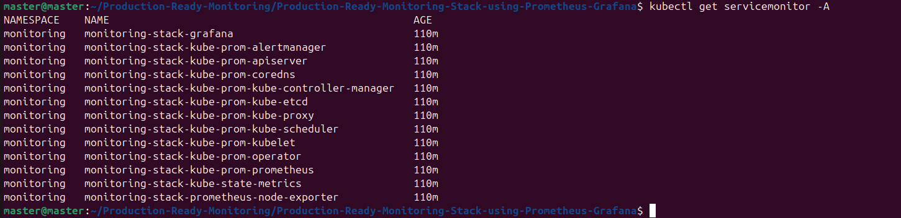

---

## Grafana Data Sources

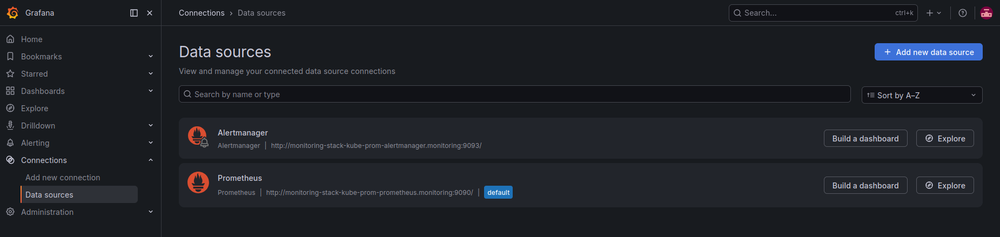

---

## Grafana Dashboard - CoreDNS

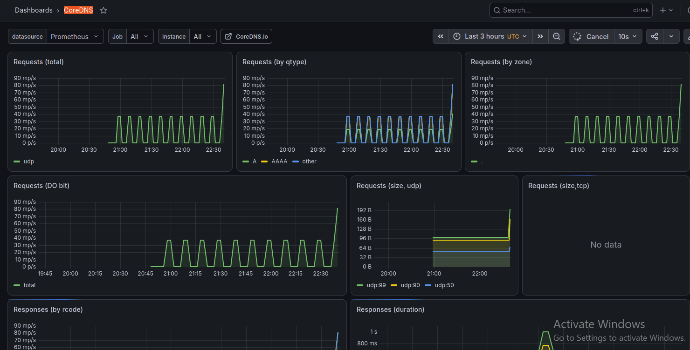

---

## Grafana Dashboard - Alertmanager

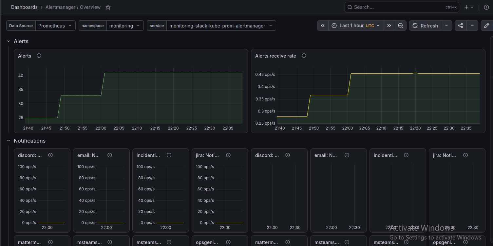

---

## Grafana Dashboard - Kubernetes API Server

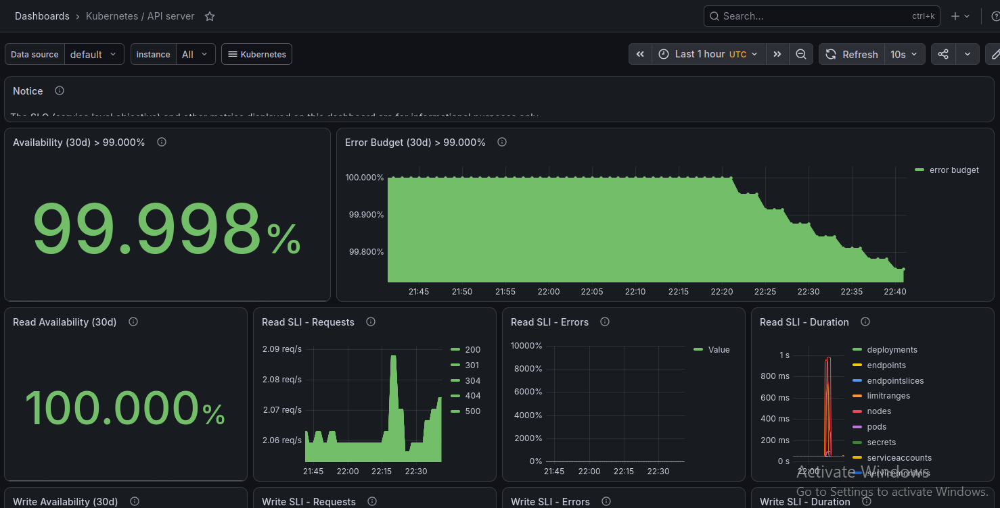

---

## Grafana Dashboard - Kubernetes Kubelet

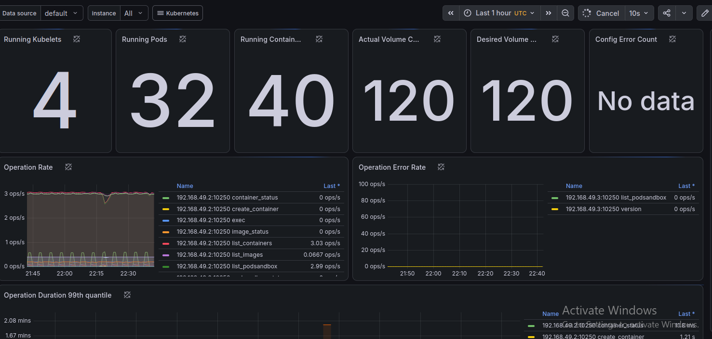

---

## Prometheus Target Health

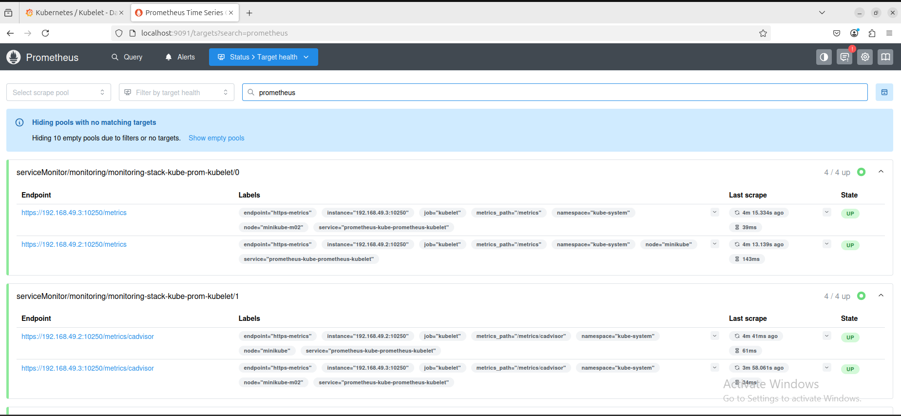

---

## Prometheus Query

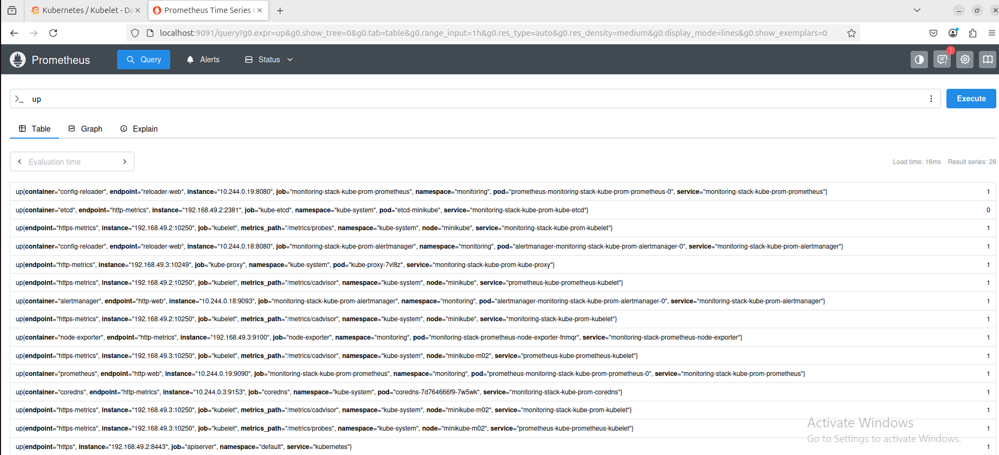

---

## Prometheus Service Discovery

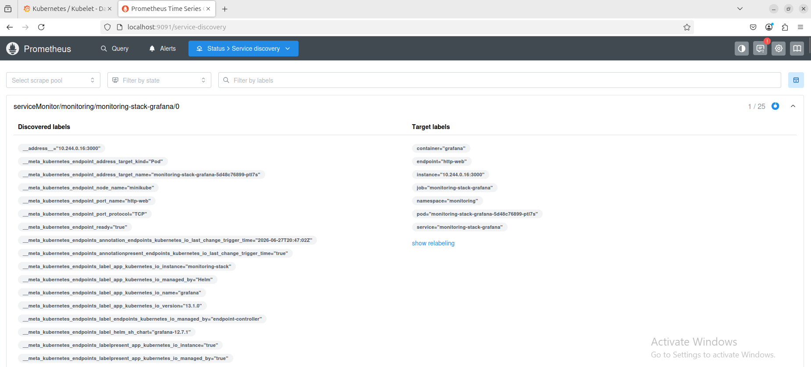

---

## Sample Application

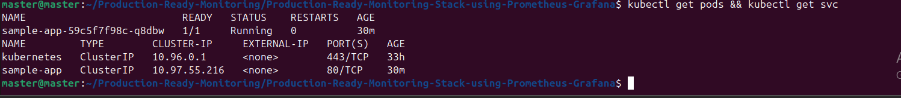

---

# Result

The monitoring stack was successfully deployed and verified.

The project confirms:

- Helm deployment completed successfully.
- Grafana and Prometheus are fully operational.
- Kubernetes components are being monitored.
- A sample application was deployed successfully.
- Monitoring dashboards and Prometheus targets are working as expected.
